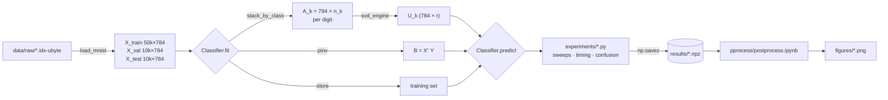

# Linear-Algebra Digit Classifiers

**Handwritten digit recognition on MNIST using computational linear algebra: a Golub–Kahan SVD written from scratch, SVD subspace projection, k-nearest neighbors and multivariate least squares, each checked against a library reference.**


---

## Overview

This project started as the final exam for **MAT-55 (Computational Linear Algebra)** at ITA. The task was to classify handwritten digits with classical linear-algebra methods instead of neural networks, and to understand each method well enough to build it yourself.

The project answers three questions:

1. **Can you implement a production-quality SVD from first principles?** The `linalg/` package builds the full SVD pipeline from textbook algorithms (Golub & Van Loan): Householder bidiagonalization followed by implicit-shift Golub–Kahan QR iterations.
2. **How do different linear-algebra views of classification compare?** Three families are implemented and tuned on a held-out validation split:
   - **Subspace projection:** each digit class is modeled by its leading *r* left singular vectors.
   - **Instance-based:** k-nearest neighbors computed with fully vectorized distance matrices.
   - **Linear regression:** multivariate least squares on one-hot targets, solved with the pseudoinverse.
3. **Are the from-scratch results correct?** Each custom component has a library "golden reference" (`numpy.linalg.svd`, `sklearn` `KNeighborsClassifier` and `Ridge`). The references are compared on both accuracy and internal structure. For example, the scratch and NumPy SVDs learn the same subspaces: their projectors agree to about 1e-15.

### Results (MNIST test set, 10,000 images)

The table shows each method at the best hyperparameter found on validation. The numbers come from `results/final_comparison.npz`.

| Method | Hyperparameter | Test accuracy | Fit time | Predict time |
|---|---|---:|---:|---:|
| SVD subspace (NumPy engine) | r = 30 | **95.53 %** | 13.2 s | 0.07 s |
| SVD subspace (**scratch** engine) | r = 30 | **95.53 %** | 183.5 s | — |
| kNN (scratch) | k = 1 | **96.77 %** | ~0 s (lazy) | 18.4 s |
| kNN (scikit-learn) | k = 1 | 96.77 % | 0.04 s | 5.6 s |
| Multivariate least squares (scratch) | — | 85.39 % | 4.3 s | 0.006 s |
| Ridge regression (scikit-learn) | α = 600 | 86.43 % | 0.57 s | 0.02 s |

> The largest difference between the scratch and NumPy SVD projectors on full MNIST is **2.6 × 10⁻¹⁵**. The two engines produce the same classifier; the scratch engine is slower because its inner loops run in pure Python.

Plots in [`figures/`](figures/) cover:

- accuracy vs. *r*, *k* and α
- confusion matrices, with log-scaled versions for each method
- Eckart–Young residual curves
- accuracy vs. computational cost

---

## Key Features

- **SVD built from scratch** (`linalg/`)
  - Householder reflectors (G&VL Alg. 5.1.1) and Givens rotations (Alg. 5.1.3)
  - Householder bidiagonalization with rank-1 (Level-2 BLAS style) updates (Alg. 5.4.2)
  - Implicit-shift Golub–Kahan SVD step with Wilkinson shift, run as a scalar bulge chase (Alg. 8.6.1)
  - Iteration driver with deflation, unreduced-block detection and an iteration cap (Alg. 8.6.2)
  - Handles tall and wide matrices (by transposing), sign correction, descending sort and rank-*k* truncation
  - `want="U" | "V" | "both"` computes only the singular vectors you need
  - For blocks with a zero on the diagonal, it falls back to a library SVD for that block and emits a `RuntimeWarning`
- **Classifiers behind one interface** (`classifiers/`)
  - `SVDSubspaceClassifier` has a *pluggable SVD engine*: pass the scratch SVD or the NumPy adapter
  - `KNNClassifier` computes all pairwise squared distances in one step and selects neighbors with `argpartition`
  - `MultivariateLSClassifier` computes B = X⁺Y on one-hot targets and predicts with `argmax`
  - Scikit-learn wrappers serve as golden references
- **Data loader with no dependencies** (`data/mnist.py`)
  - Reads the raw IDX binary format and validates the magic numbers
  - Normalizes pixels to [0, 1] and makes a seeded, reproducible 50k / 10k train/validation split
- **Experiment pipeline** (`experiments/`)
  - Hyperparameter sweeps chosen on validation, with the test set scored once at the end
  - Timing, confusion matrices, Eckart–Young residuals and a final comparison table
  - Every result is saved as `.npz`
- **Post-processing notebook** (`pprocess/postprocess.ipynb`) turns the saved results into report-ready figures and does no training.
- **Property-based test suite** (`tests/`)
  - Checks orthogonality, reconstruction and singular-value preservation
  - Tests the scalar GK step against a reference that materializes the full matrix
  - Covers edge cases: repeated or clustered singular values, rank deficiency, wide matrices and truncation

---

## Architecture & Tech Stack

### Tech stack

| Layer | Tools |
|---|---|
| Language | Python 3.12 (uses `str \| Path` union syntax, so needs ≥ 3.10) |
| Numerics | NumPy (arrays and BLAS matrix products; the SVD itself is written by hand) |
| Reference models | scikit-learn (`Ridge`, `KNeighborsClassifier`) |
| Visualization | Matplotlib and Jupyter (the notebook renders labels with LaTeX) |
| Testing | pytest |

### Project layout

```
.
├── linalg/                  # From-scratch numerical linear algebra
│   ├── householder.py       #   house(x)            -> Householder vector, beta
│   ├── givens.py            #   givens(a, b)        -> (c, s)
│   ├── bidiagonal.py        #   bidiagonalize(A)    -> U, d, f, V
│   ├── svd_utils.py         #   deflate, find_block, wilkinson_shift, fix_signs
│   ├── svd_core.py          #   gk_step (bulge chase), zero-diagonal fallback
│   ├── bidiag_svd.py        #   bidiag_svd: iteration driver
│   └── svd.py               #   svd(A, want, k): public API
├── classifiers/
│   ├── base.py              # Abstract Classifier (fit / predict / score)
│   ├── svd_subspace.py      # SVD subspace classifier + numpy_svd_engine adapter
│   ├── knn.py               # Vectorized kNN
│   ├── mls.py               # Multivariate least squares
│   └── sklearn_ref.py       # scikit-learn golden references
├── data/
│   ├── mnist.py             # IDX reader, load_mnist, stack_by_class
│   └── raw/                 # MNIST IDX files (committed, ~127 MB incl. archive)
├── experiments/             # Sweep, comparison and diagnostic scripts -> results/*.npz
├── results/                 # Saved experiment outputs (.npz)
├── pprocess/
│   └── postprocess.ipynb    # Reads results/, writes figures/
├── figures/                 # Generated plots (PNG)
├── tests/                   # pytest suites
├── pytest.ini               # Puts the repo root on sys.path; testpaths = tests
└── conftest.py              # Root marker for pytest (empty)
```

### Design patterns

- **Template Method / abstract base class.** `classifiers.base.Classifier` defines the `fit`/`predict` contract and a shared `score()`. Every model, including the scikit-learn wrappers, can therefore be used interchangeably by the experiment scripts.
- **Strategy (pluggable engine).** `SVDSubspaceClassifier(svd_engine=...)` accepts any callable with the signature `engine(A, want="U", k=r) -> (U, s)`. `numpy_svd_engine` is an *Adapter* that gives `np.linalg.svd` the same signature as the scratch `svd`. The same classifier code therefore runs on either engine, which makes the comparison between them direct.
- **Layered numerical kernel.** `svd()` → `bidiagonalize()` + `bidiag_svd()` → `gk_step()` / `deflate()` / `find_block()` → `house()` / `givens()`. Each layer maps to one textbook algorithm and is tested on its own.
- **In-place, scalar bulge chasing.** The GK step never builds the bidiagonal matrix B. It updates the diagonal `d` and superdiagonal `f` arrays directly and applies the rotations to the U/V accumulators only when those are requested.
- **Experiments separated from analysis.** The experiment scripts do the expensive work and save plain `.npz` files. The notebook only reads those files, so you can iterate on plots without retraining.

### Data flow



### How each classifier decides

| Classifier | Training | Prediction for sample x |
|---|---|---|
| SVD subspace | For each digit k, take the SVD of the class matrix A_k and keep the leading r left singular vectors U_k | `argmax_k ‖U_kᵀ x‖²`: the class whose subspace captures the most energy, which is the same as the smallest projection residual |
| kNN | Store the training set | Majority vote among the k nearest neighbors by Euclidean distance |
| Least squares | B = X⁺ Y, with Y the one-hot label matrix | `argmax(x B)` |

The Eckart–Young experiment explains why the subspace method works. The relative residual ‖A_k − A_{k,r}‖_F / ‖A_k‖_F falls quickly as r grows, so each digit class is close to a low-rank subspace.

---

## Getting Started

### Prerequisites

- **OS:** Linux or macOS. Windows should work, but the project was developed on Linux.
- **Python:** 3.10 or newer (developed on 3.12.3).
- **Memory:** about **8 GB of RAM** for the full-MNIST scratch kNN run. It builds a 10,000 × 50,000 float64 distance matrix, roughly 4 GB. Set `CHUNK_TEST` in `experiments/experiment_knn.py` to limit memory use.
- **Optional:** a LaTeX installation, because the notebook sets `text.usetex=True`. You can also set that option to `False` in the first cell.
- **Dataset:** MNIST is **already included** in `data/raw/`, so no download is needed.

### Installation

```bash
git clone <repo-url>
cd <repo>

python3 -m venv .venv
source .venv/bin/activate

pip install numpy scikit-learn matplotlib pytest jupyterlab
```

The project has no `requirements.txt`. It was tested with numpy 2.4, scikit-learn 1.9, matplotlib 3.11 and pytest 9.0.

### Quick usage

```python
from data.mnist import load_mnist
from classifiers.svd_subspace import SVDSubspaceClassifier, numpy_svd_engine
from linalg.svd import svd as scratch_svd

data = load_mnist("data/raw")

clf = SVDSubspaceClassifier(r=30, svd_engine=numpy_svd_engine)   # or scratch_svd
clf.fit(data["X_train"], data["y_train"])
print(clf.score(data["X_test"], data["y_test"]))                  # ≈ 0.955
```

The from-scratch SVD also works on its own:

```python
import numpy as np
from linalg.svd import svd

A = np.random.randn(100, 30)
U, s, V = svd(A, want="both")        # A ≈ U @ diag(s) @ V.T
Uk, sk  = svd(A, want="U", k=5)      # top-5 left singular vectors only
```

### Running the experiments

Run the scripts **from the repository root**, because they read `data/raw/` and write `results/` relative to the current directory. Each script adds the repo root to `sys.path` itself, so `python experiments/<script>.py` and `python -m experiments.<script>` both work.

```bash
# 1. Per-method hyperparameter sweeps (each writes results/<name>.npz)
python -m experiments.experiment_svd_subspace   # r sweep + scratch-vs-numpy check
python -m experiments.experiment_knn            # k sweep (slow, memory heavy)
python -m experiments.experiments_ls            # LS + Ridge agreement
python -m experiments.experiment_sklearn_knn
python -m experiments.experiment_sklearn_ridge

# 2. Diagnostics and the final comparison (uses BEST_R / BEST_K / BEST_ALPHA
#    constants at the top of each script: update them after step 1)
python -m experiments.experiment_confusion_and_eckart
python -m experiments.experiment_final_comparison   # includes ~3 min scratch-SVD fit

# 3. Figures
cd pprocess && jupyter lab postprocess.ipynb
```

### Running the tests

```bash
# All suites (175 tests, ~15 s)
python -m pytest
```

`pytest.ini` puts the repo root on `sys.path` and sets `tests/` as the test directory, so the command above works from any folder in the repo. The tests find `data/raw/` relative to their own location, not the current directory.

| Suite | What it covers |
|---|---|
| `tests/test_linalg.py` | Householder, Givens and bidiagonalization primitives |
| `tests/test_svd.py` | Full property-based SVD suite: primitives, GK step against a matrix reference, and edge cases for `svd()` |
| `tests/test_svd_subspace.py` | The subspace classifier on **both** SVD engines, including a check that they learn the same subspaces and make the same predictions |
| `tests/test_mnist.py` | Loader shapes, `float64` dtype and [0, 1] range, seeded determinism and `stack_by_class` |

The tests that need MNIST (`test_mnist.py` and the real-data subsample in `test_svd_subspace.py`, which must exceed 85 % accuracy) skip automatically if `data/raw/` is missing.

---

## References

- G. H. Golub & C. F. Van Loan, *Matrix Computations*, 4th ed., Johns Hopkins University Press: Algorithms 5.1.1, 5.1.3, 5.4.2, 8.6.1 and 8.6.2.
- L. Eldén, *Matrix Methods in Data Mining and Pattern Recognition*, SIAM: Chapter 10, handwritten digit classification with the SVD.
- Y. LeCun, C. Cortes & C. J. C. Burges, *The MNIST database of handwritten digits*.

## Author

**David Arias** ([@ariasdvg](https://github.com/ariasdvg)). Built for the MAT-55 exam at ITA.
